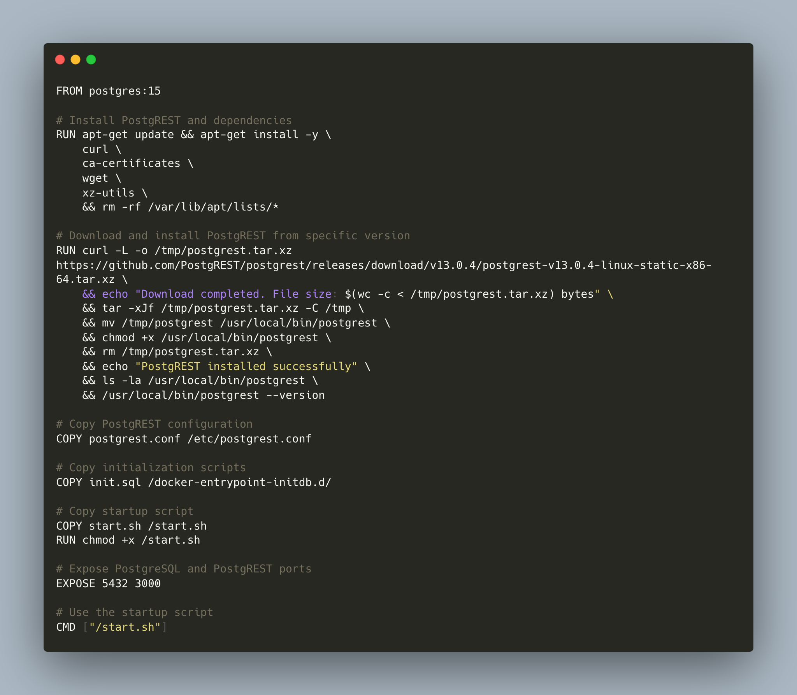
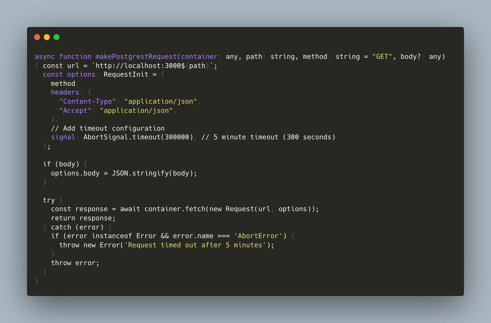

+++
title = 'Running Postgres on Cloudflare Containers'
date = 2025-06-30T23:06:23-05:00
draft = false
readTime = true
tags = ['postgres', 'cloudflare']
+++

**Disclaimer:** I work for Cloudflare. The views and opinions expressed in this post are my own and do not necessarily reflect the official policy or position of Cloudflare.

Cloudflare recently launched [Cloudflare Containers](https://blog.cloudflare.com/containers-are-available-in-public-beta-for-simple-global-and-programmable/) allowing running containerized
applications with workers. To use this, an user would need to define an application in a dockerfile, define a worker, and bind the container to that worker. Naturally, I was curious if we can run Postgres on the new
container platform.

I decided to use Postgrest in the front as a REST API and to use that API from my worker. My dockerfile
installs and starts both Postgres and Postgrest, it looks like this 

The container runs a shell script that installs Postgrest and waits for Postgres to start, it looks like this

Postgrest is configured to connect to postgres on localhost on port 5432, and listens on port 3000 

The final piece is the actual worker, which is a HonoJS app and simply calls out to postgrest on port 3000. This is an example request 

To deploy this, clone the repo https://github.com/achanda/cloudflare-postgres-containers, cd to the target directory and use wrangler to deploy. Once the api is up
access it using curl 

Note that it might take a while for the container to start, the api will return an error while that happens. Once the container is up then subsequent requests
should be instantaneous.
